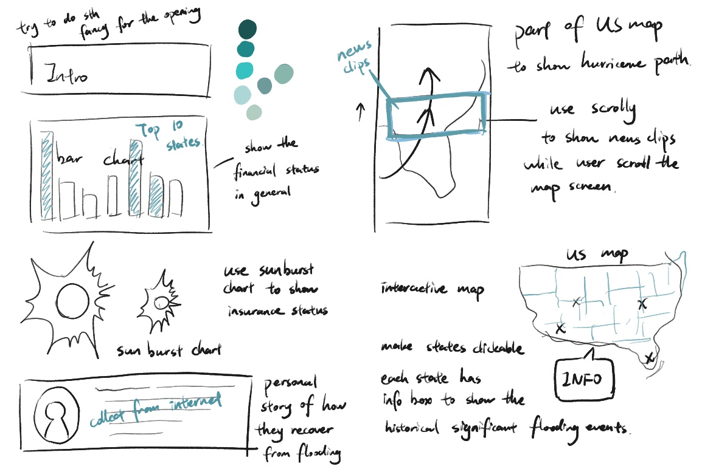

<b><i>Please view my work through the buttons above.</b></i>

This data visualization project was created for Perci.us, a platform that empowers users to develop comprehensive evacuation strategies, digitally secure essential documents, create emergency supply lists, and establish communication plans with trusted contacts. Many people tend to perceive natural disasters as distant concerns, merely following news coverage without recognizing their proximity and impact. To raise awareness about one of the most frequent disasters in the U.S.—flooding—we focused on this critical topic. Our goal was to tell the stories behind the data in a more human-centric and compelling manner.

## Before the Start

The process of collecting data was both crucial and time-intensive. Beyond the sparse information available on news websites, it was essential to source data that was both reliable and up-to-date. For the charts, we utilized data from FEMA, as it provided the necessary accuracy and freshness required for the project.

The initial concept was to create an infographic divided into three sections: the first featuring charts to illustrate the financial losses caused by flooding events, supplemented with an interview story of someone who successfully recovered financially after the disaster. The second section was a timeline highlighting the history of major floods. The final section would delve into the varying statuses and attitudes of different demographic groups. However, after multiple discussions and drafts, we decided to enhance the format by making it more interactive and reader-friendly. This led to the idea of developing a data visualization web page. 

Building on the basic structure, I made additional modifications to emphasize the logical connections between sections, ensuring that the entire article flows seamlessly as a cohesive and engaging narrative.

## Web Design

To build the web page from scratch, I used JavaScript, HTML, and CSS to ensure both the content and structure function effectively. For the opening page, I employed a full-screen view to create a strong visual impact for the topic title. Since this data visualization page is intended to integrate with the Perci website, I carefully selected a color palette and theme that align with the overall website design. Additionally, I ensured that the charts and artistic style maintained consistency throughout the page.

Furthermore, recognizing that Perci’s users will primarily access the page through their app, it was essential to optimize the design for mobile screens. This introduced additional considerations to ensure the page is responsive and user-friendly across various devices.



## Data Visualization

I placed the most data-intensive section at the beginning to highlight the serious financial impacts. This part not only addresses the economic aspects but also focuses on individual insurance situations. It includes a bar chart showcasing the top 10 states with the highest financial losses. Based on these states, two circular charts illustrate the insurance payouts. To ensure the charts are clear and not overly wordy, users can hover over specific sections of the charts to view detailed information in a pop-up infobox. Additionally, users can freely zoom in on different parts of the charts for a closer look.

While working on this project, two major hurricanes, Helene and Milton, struck the mainland, causing significant damage across several states. Since hurricanes are a primary cause of flooding, I decided to address this connection in my article. To keep the stories separate, I created two independent subpages—one for each hurricane. Rather than featuring personal stories, I replaced this section with the latest news clips covering disaster reports.

To enhance readability and make the content visually engaging, I designed three cartoon GIFs using Procreate and Adobe After Effects. These mini animations explain how hurricanes lead to flooding in nature. I also created two concept maps of the U.S., using our custom color theme to illustrate the hurricanes' moving paths. These maps serve as background images, and with the help of the Scrollama scripts, news clips appear one by one as the user scrolls through the page.

```javascript
document.getElementById('helene-button').onclick = function() {
    document.getElementById('scrolly').style.display = 'block';
    document.getElementById('scrolly-article-1').style.display = 'block';
    document.getElementById('scrolly-article-2').style.display = 'none';
    document.querySelector('#hurricane-maps-helene').style.display = 'block';
    document.querySelector('#hurricane-maps-milton').style.display = 'none';
};

document.getElementById('milton-button').onclick = function() {
    document.getElementById('scrolly').style.display = 'block';
    document.getElementById('scrolly-article-2').style.display = 'block';
    document.getElementById('scrolly-article-1').style.display = 'none';
    document.querySelector('#hurricane-maps-milton').style.display = 'block';
    document.querySelector('#hurricane-maps-helene').style.display = 'none';
};

var scroller = scrollama();

function handleStepEnter(response) {
    document.querySelectorAll("#scrolly-article-1 .step").forEach(step => {
        step.classList.remove("is-active");
    });
    response.element.classList.add("is-active");

    if (document.querySelector('#hurricane-maps-helene').style.display === 'block') {
        const heleneMap = document.querySelector("#hurricane-maps-helene");
        switch (response.index) {
            case 0:
                heleneMap.style.objectPosition = "center top";
                break
            case 1:
                heleneMap.style.objectPosition = "center center";
                break
            case 2:
                heleneMap.style.objectPosition = "center bottom";
                break
            default:
                heleneMap.style.objectPosition = "center bottom";
        }
    }
}
```

I moved the historical flooding events section at the end to highlight the increasing frequency of such events. For this, I used D3.js to embed a U.S. map on the page. Each state on the map is clickable, allowing users to select a state and view a table containing information on significant flooding events that occurred there in the past. This includes details like the dates, paid losses, and net payments. The data in the table is sorted by date, with different ranges of loss amounts represented by various colors to make the information visually easier to interpret.

## Conclusion

This project is my first work of web development and with JavaScript. The whole building experience and the learning process was extremely fun to me. It was really exciting to learn and be inspired by the creativity of other data visualization works. Diving into JavaScript for the first time felt like unlocking a whole new world of possibilities, where every challenge brought with it an opportunity to grow and explore new ideas. 

I particularly enjoyed experimenting with interactive elements and bringing static data to life through dynamic visuals. Each step, from troubleshooting errors to tweaking designs, gave me a deeper understanding of how web technologies work together to create something engaging and meaningful. 

Beyond the technical skills, this project allowed me to appreciate the power of visual storytelling. It’s amazing how a well-designed visualization can turn complex data into something accessible and impactful. This experience has definitely sparked a passion for combining creativity and technology, and I can’t wait to explore more advanced techniques in future projects.