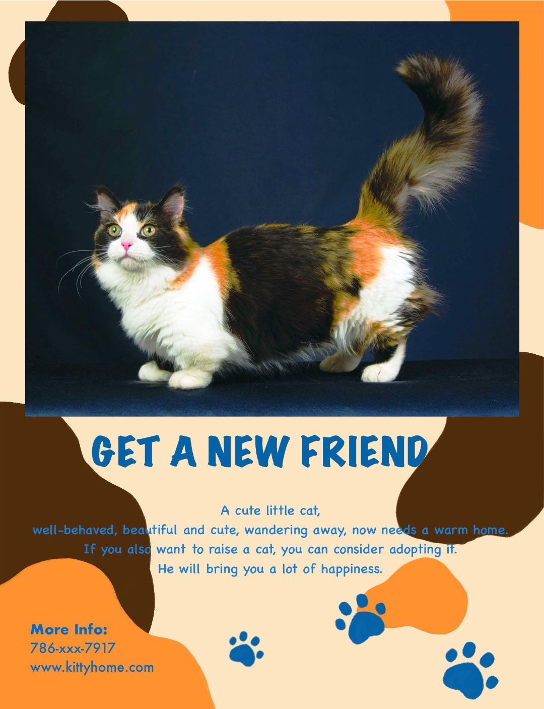
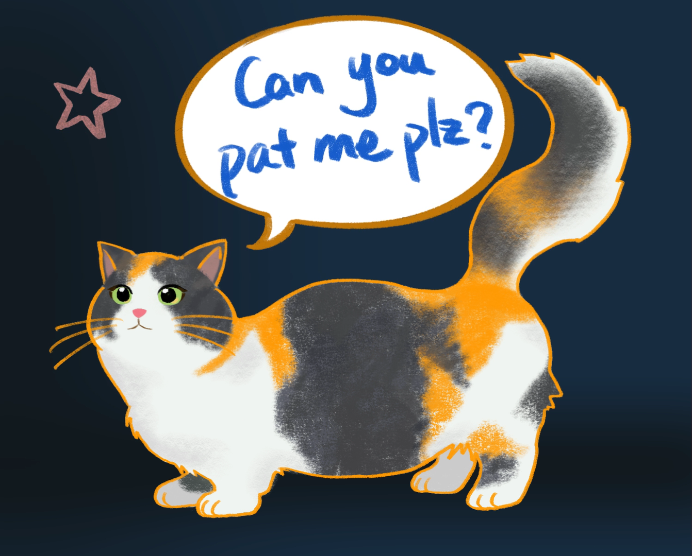
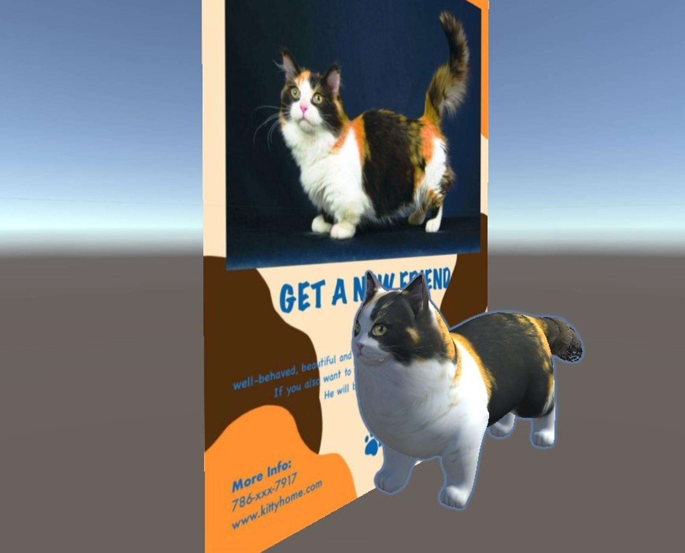

Augmented Reality is a versatile technology with applications across various fields. One such example involves implementing AR with pet adoption initiatives. By enhancing adoption posters with AR elements, the application aims to make the process more engaging and appealing. Through interactive features, users can experience a dynamic presentation of adorable pets in need of homes. This innovative approach not only captures attention more effectively but also broadens the appeal, particularly among children and individuals drawn to immersive experiences.

## Design

Using the image of the cat in need of adoption, I crafted a personalized pet adoption poster that works as the AR image target. When the camera detects this poster, the static image of the cat springs to life, delighting viewers as they witness her animated movements in the photo. To enhance interactivity, I added virtual buttons into the poster. With touching specific part of the poster, users can summon a 3D model of the cat, complete with lifelike animations depicting typical cat behaviors. This interactive feature not only engages users but also fosters a deeper connection with the adorable pet, ultimately increasing the likelihood of successful adoption.



## Development

Considering about the potential for heightened enjoyment, I created the 2D animation with Adobe Effect and embedded it into the pet adoption poster. This animation transforms the cat from the photo into a lively cartoon character, enhancing the visual appeal. To amplify the interesting experience, I included twinkling stars as decorative elements and developed the character with subtle movements like blinking eyes, wagging tail, ear flicks, and paw motions. Moreover, for the transition from the 2D animation to the subsequent 3D interaction, the cartoon cat features a speech balloon inviting users to engage further: "Can you pat me please?" This gentle prompt guides users to interact with the poster, triggering the virtual button and summoning the 3D cat with its own cute animations.




When adding a video beneath the parent object image target, the 2D animation inadvertently begins playing in the background, regardless of whether the target is detected or not. To solve this problem, modifications need to be made to the default script within the image target database, as the part of codes shown below:

```c
protected virtual void OnTrackingFound()
{
    if (mObserverBehaviour)
        SetComponentsEnabled(true);

    OnTargetFound.Invoke();
}

protected virtual void OnTrackingLost()
{
    if (mObserverBehaviour)
        SetComponentsEnabled(false);

    OnTargetLost.Invoke();
}
```

The simultaneous appearance of both the 2D animation and the 3D model must be prevented, as they share the same parent object. Commands are linked directly to a virtual button, specifying that the character's status can only be activated upon pressing the button:

```c
public class VirtualButton : MonoBehaviour
{
    public VirtualButtonBehaviour Vb;
    public GameObject cat;

    void Start()
    {
        Vb.RegisterOnButtonPressed(OnButtonPressed);
        Vb.RegisterOnButtonReleased(OnButtonReleased);

        cat.SetActive(false);
    }

    public void OnButtonPressed(VirtualButtonBehaviour vb)
    {
        Debug.Log("Button is pressed.");
        cat.SetActive(true);
    }

    public void OnButtonReleased(VirtualButtonBehaviour vb)
    {
        cat.SetActive(false);
    }
}
```

## Application Showcase

This demo video illustrates the previously described logic: the target image triggers the transition from a photo to a 2D animation, and pressing the virtual button on the poster reveals the 3D model of the cat. 

<!--  -->
<div style="display: flex; justify-content: center; align-items: center;">
  <video width="640" controls>
    <source src="/images/democat.mp4" type="video/mp4">
    Your browser does not support the video tag.
  </video>
</div>

## Progress in the Future

While implementing the AR experience, I encountered a few challenges that needed addressing. Initially, my plan was to allow users to physically "pat" the cat to activate the 3D character. However, I discovered that in AR, the 2D animation consistently appears above the user's hand, obscuring the interaction. To rectify this issue, I relocated the virtual button from the photo to a more accessible position below the cat on the poster, ensuring a smoother user experience.

Additionally, instead of utilizing the Unity package, I have this GLB file for the 3D model within the application. However, both the model and its animations were embedded within the package, making it challenging to separate them. Despite this obstacle, I'm exploring solutions to streamline the process and enhance the overall functionality of the AR application.