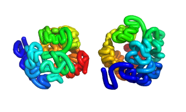

To discuss the complex systems formulated from the three-dimensional structure of the genome, we first start with the cross-linked chromatin. Chromatin is cross-linked with formaldehyde, which links proteins to DNA and proteins to proteins. Specifically, the chromatin is cross-linked with CTCF, transcription factors, and other proteins. After cross-linking, the chromatin is digested with a restriction enzyme that leaves 5' overhangs. Scientists then fill in the overhangs with nucleotides, one of which is biotinylated. This step allows them to dilute the sample and perform proximity ligation, joining DNA fragments that are in close spatial proximity. The biotinylated fragments are then captured on streptavidin beads. Next-generation sequencing is used to sequence the paired-end reads. This makes it easier to map the reads to the reference genome. After quality checks and filtering, a Hi-C heatmap can be constructed based on the Hi-C contact matrix, revealing the spatial organization of the genome.

Specifically in Linux, I run BWA to map paired-end reads, which are stored in two FASTQ files, to the reference genome. After generating the separate SAM files for these two FASTQ files, a common line in the SAM files looks like:

```
SRR027956.66.1 16 chrX 74208408 37 76M * 0 0 TCCATAATGAATTGTATTTGAAAAGTCCACAAAATTCACCCAACGAATATTTACTGAATGCNTATCTAATTGCAAC IIIIIIIIIIIIIIIIIIIIIIIIIIIIIIIIIIIIIIIIIIIIIIIIIIIIIIIIIIIIIIIIIIIIIIIIIIII XT:A:U NM:i:1 X0:i:1 X1:i:0 XM:i:1 XO:i:0 XG:i:0 MD:Z:61T14
```

From these SAM files, I extract the ID and the mapping coordinates. In the example above, the ID is <kbd>SRR027956.66.1</kbd> and the coordinate is <kbd>74208408</kbd>. To compare the two hash variables and match the same keys in both files, I create a hash to store the pairs, with the ID as the key and the corresponding coordinate as the value, line by line. This process helps build the contact library.

Based on this contact library, the next step is to generate the Hi-C contact matrix for chromosome X (Human, build hg18). According to our data, the length of chromosome X is 154,913,754 base pairs, and the resolution we are focusing on is 1 megabase (1,000,000 base pairs). This means we split the X chromosome into 155 segments, each 1 megabase in length. The size of our contact matrix is 155 by 155, representing interactions between these segments. Once the contact matrix is generated, we can use it to produce the desired Euclidean distance matrix.

```perl
my @distance_matrix;
for (my $i = 0; $i < $new_size; $i++) {
    for (my $j = 0; $j < $new_size; $j++) {
        my $value = $filtered_matrix[$i][$j];
        if ($value == 0){
                $value = 1;
        }
        my $distance = (1 / $value) ** (1/3);
        if ($i == $j){
                $distance = 0;
        }
        $distance_matrix[$i][$j] = $distance;
    }
}

open(OUT, ">", "chrX_1Mb_distance_map.txt");
for (my $i = 0; $i < $new_size; $i++) {
    for (my $j = 0; $j < $new_size; $j++) {
        print OUT $distance_matrix[$i][$j] . " ";
    }
    print OUT "\n";
}
close (OUT);
```

With the Metric Multidimensional Scaling (MDS) function from Scikit-learn, if provided a distance matrix, the function `sklearn.manifold.MDS` can return the 3D coordinates (`n_components=3`).

<i>sklearn.manifold.MDS.html: http://scikit-learn.org/stable/modules/generated/</i>

```perl
from sklearn.manifold import MDS
import numpy as np

# Load the distance matrix from file
with open("chrX_1Mb_distance_map.txt", "r") as file:
    distance_matrix = [[float(value) for value in line.split()] for line in file]

# Convert the distance matrix to numpy array
distance_matrix = np.array(distance_matrix)

# Initialize MDS with 3 dimensions
mds = MDS(n_components=3, dissimilarity='precomputed', random_state=42)

# Perform MDS and get the 3D coordinates
coordinates = mds.fit_transform(distance_matrix)

# Save the coordinates to file
with open("chrX_1Mb_coordinates.txt", "w") as file:
    for coordinate in coordinates:
        file.write(f"{coordinate[0]} {coordinate[1]} {coordinate[2]}\n")  
```

The last step is to visualize the structure by using PyMOL:



Reconstructing the 3D structure of the X chromosome is a significant research area in genomics and structural biology. This process involves creating a three-dimensional model of the X chromosome, which is one of the two sex chromosomes in humans and other mammals. The 3D structure is crucial for understanding the spatial organization of chromatin, the complex of DNA and proteins that forms chromosomes.