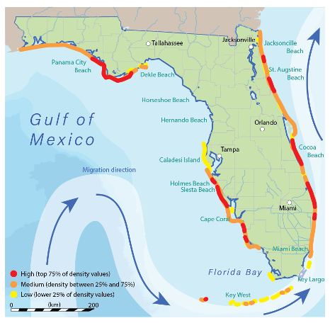

The entire journey to complete this graph has been incredibly meaningful, greatly enriching my grasp of presenting data in a simpler and more attractive manner. To ensure a higher quality, I learned a lot from diverse guidelines and instructional books. Alongside, I acquired proficiency in using Adobe Illustrator, elevating my ability to craft visually appealing charts. This article serves as a 'making-of' narrative, delving into key aspects like topic selection, data collection, the art of data visualization, continuous improvements, and reflective insights gained along the way.

## Topic Selection

When considering a topic on my own, the idea of researching sea turtles immediately came to mind. Given that I'm studying in a coastal city with various teams exploring marine life, it seemed like a relevant subject. Initially, my interest was in understanding their living habits and territories in the state. However, my focus shifted towards exploring their migration routes, and eventually I decided to concentrate on their nesting status. Here is my draft at the very beginning.

## Data Collection

The initial step involves the collection and processing of data essential for my graphs. To ensure the accuracy and efficiency of the information I need to present to readers, it is imperative that the data sources have to be authoritative.

For this project, the majority of my information and data were sourced from the Florida Fish and Wildlife Conservation Commission. Their dedicated teams conduct real-time research on Florida's wildlife and share their findings on the official website. Unlike my previous experiences, I didn't have pre-organized datasets at my disposal this time. This meant I had to manually collect the required data and information directly from the website.

<i>Sea Turtle Nesting: https://myfwc.com/research/wildlife/sea-turtles/nesting/</i>

<i>Florida Sea Turtle Nesting Beach Monitoring Program:

https://myfwc.maps.arcgis.com/apps/webappviewer/index.html?id=8e6e45efc47a4c69941ddcb097cb195a</i>

## Data Visualization

### Bar Chart

I used both vertical and horizontal bar charts to visually represent two distinct sets of data. The column bar chart illustrating the statewide nest numbers for three types of sea turtles. This layout shows a clear comparison of the number differences from 2018 to 2022. On the right side, a stacked bar chart showcases their general survival rates across various life periods. The brighter sections highlight a critical fact that the actual survival rates are remarkably low.

### Line Chart

The line chart illustrates intriguing trends in the nesting numbers of three types of sea turtles along the beachside from 1989 to 2021. Actually, I combined three charts together from the paper they published in the website. The lines depict a dynamic pattern, characterized by fluctuations rather than stability. This phenomenon can be attributed to the natural behavior of sea turtles – as they mature, they migrate from the feeding areas to breeding locations closer to the nesting beaches. This migration occurs every 2-3 years, providing a logical explanation for the observed rises and drops in the chart. Also I added colors in this chart align with my color palate in this project.

### Map

The nesting density information along the beachside depicted on this map is sourced from the Florida Sea Turtle Nesting Beach Monitoring Program. To enhance clarity, I categorized the density into three levels, using red to highlight areas with density over 75% and yellow for the lowest level below 25%. Additionally, I included well-known city names and beach labels to provide a clearer geographical context.

To further enrich the map, I incorporated migration route directions near Florida, drawing out from another image resource. This integration aims to make the map more informative by presenting both nesting density and migration routes on a single visual.

## Illustrations

To add visual appeal to the graph, I placed images of sea turtles. These illustrations effectively highlight the distinct body features of the three types, including their average body size and weight as adult (The color I use here doesn't necessarily reflect real-life colors. I just want to make the color palate of the graph harmonious and balanced presentation). Through this section, I aim to provide readers with a foundational understanding of the key characteristics that distinguish each type of sea turtle.

Additionally, I've drawn a picture of a seashore with a sea turtle swimming in the as the background for the header of the graph. This addition is intended to infuse a dynamic and attractive element, enhancing the overall visual appeal of the graph.

## Evloving for Better

### The First Version

In the initial version, I employed the preliminary draft I created at the project's inception as the foundation. Despite some charts still being in progress, I established a comprehensive structure with placeholders for pending elements. I have successfully completed a line chart and one of the bar charts. Additionally, I crafted a brief introduction along with other text sections, providing a framework for the entire project according to my draft.

### The Second Version

In Version 2, substantial progress has been made by changing the font size and replacing the placeholders with detailed images of the three sea turtles and the Florida map. This transition contributes to a more comprehensive and polished appearance for the entire graph. As part of the aesthetic enhancement, a background color resembling a sandy beach has been added, laying the foundation for the forthcoming sea shore heading illustration. This step marks a significant stride towards achieving a visually complete and engaging graph.

### The Third Version

In Version 3, the graph is nearly finalized. The addition of the background illustration in the header, completion of the last missing bar chart, and the inclusion of more details in the map, such as beach and city names along with the migration route, mark significant enhancements. However, it appears the sea turtle images are relatively large and lack specific information about their features. To ensure clarity and detail, I resized the images and incorporated more specific characteristics of each sea turtle.

### The Fourth Version

In the final version, I made subtle adjustments to refine small details. I removed the brief introduction from the header, considering the inconvenience for readers to move their head in front of such a wide poster, which can be distracting. I meticulously reorganized the structure again, ensuring an optimal space gap between each section. Additionally, I double-checked the font size and rectified any distortion, ensuring a polished and cohesive presentation. This attention to detail contributes to a seamless and visually pleasing graph for the audience.

## Reflections

### Be a Story Teller

The graphs and introductions presented in our project should not appear disjointed. Data inherently reflects the underlying logic of the information, and the truths we unveil should unfold in a coherent, step-by-step manner, maintaining a close and logical connection throughout. While we aim for an overall aesthetic, we must never sacrifice the essential link between elements for the sake of aesthetics.

### Focus On Details

Maintaining the overall consistency of the entire graph is imperative. Additionally, attention to the finer details, including the alignment of various graphical components, text introductions, font styles, sizes, and color coherence, is equally essential. I have spent countless hours to refining these details, yet I realize that there are always some aspects I may overlook if I work completely on my own without professor’s instructions. Nevertheless, I am committed to continual self-improvement and advancing my professionalism in the field of visualization.