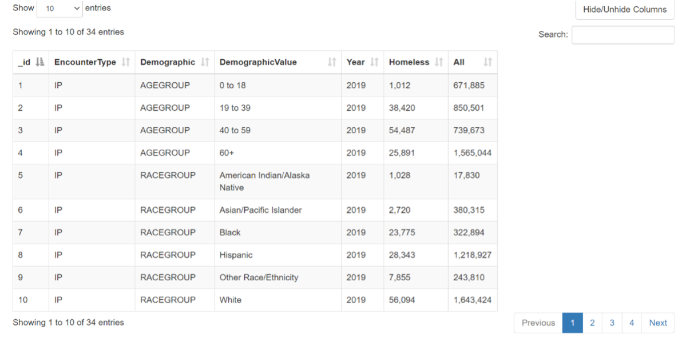
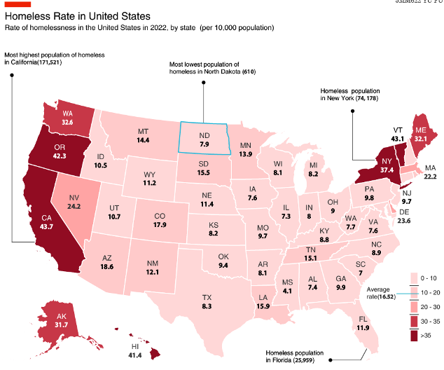
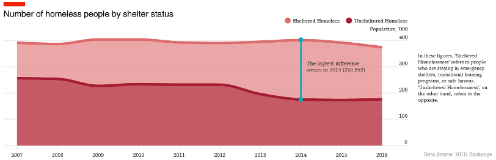
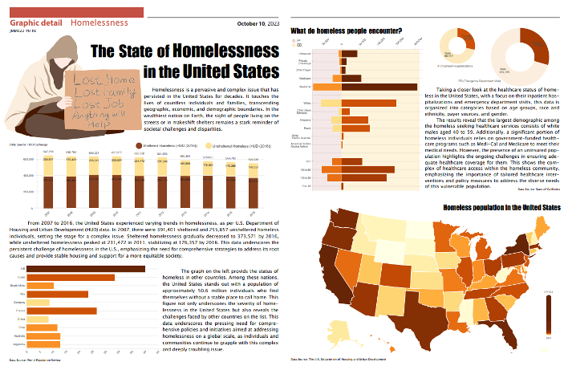
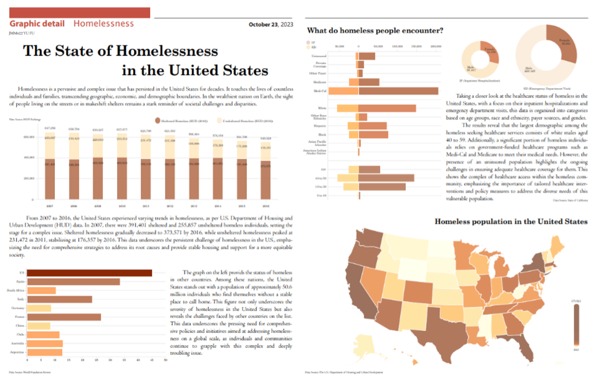
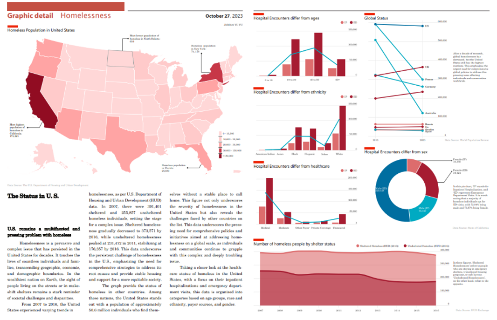
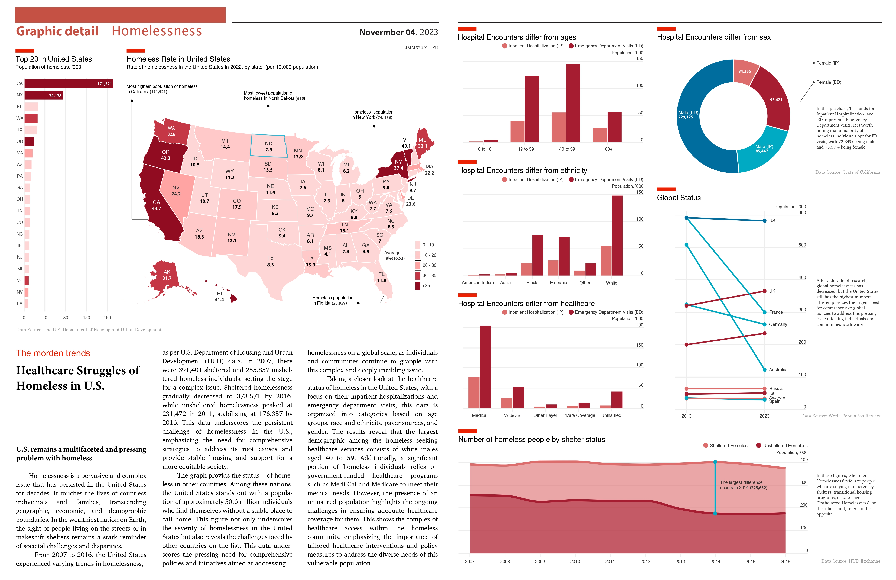

This is my first data visualization graph for the course taught by Alberto Cairo. The entire process has been exceptionally meaningful and valuable for enhancing my personal understanding of presenting data and information in a simpler and more attractive manner. To ensure a higher-quality project, I extensively studied various guidelines and instructional books. Additionally, I acquired proficiency in using Adobe Illustrator to create more visually appealing graphs. This article is a 'making-of' piece, covering the following elements: topic selection, data collection, data visualization, evolving for better and reflections. 

## Topic Selection

When considering the intricate issue of homelessness, I was immediately drawn to the pressing social issue of homelessness in the United States. To gain deeper insights into this matter, I conducted extensive research on the current state of homelessness in the country, including reading relevant news and delving into the background of the homeless population. This research serves as the foundation for my further exploration of the topic.

In recent times, local governments in the United States have committed substantial resources to address the plight of the homeless, providing essential services such as sustenance and shelter. However, my focus gravitates toward the narratives and lived experiences of these marginalized individuals, aiming to unearth profound insights into their daily lives. In this context, I have diligently curated pertinent data pertaining to their healthcare and sheltered status, enabling a candid depiction of their realities. The primary objective of this inquiry is to discern whether the prevailing conditions affecting the homeless community are ameliorating or deteriorating.

## Data Collection

The initial step involves the collection and processing of data essential for my graphs. To ensure the accuracy and efficiency of the information I need to present to readers, it is imperative that the data sources have to be authoritative.

### Data for homeless population and estimated rate in each state in U.S.

Specifically, I require data concerning the homeless population and estimated rates in each U.S. state, which will be used to create detailed map graphs. To gather this data, I often rely on sources from The U.S. Department of Housing and Urban Development. Given that this department is responsible for community planning and development, the information it provides is considered highly reliable.

<1>Link: https://www.datapandas.org/ranking/homeless-population-by-state#methodology

Link: https://www.statista.com/statistics/727847/homelessness-rate-in-the-us-by-state/ </i>

### Data for Hospital Encounters for Homeless Patients

To focus on the life conditions about homeless, the most essential part I can pay attention to is their health status. The datasets provide from California Department of Health Care Access and Information contains counts of inpatient hospitalizations and emergency department visits for persons experiencing homelessness. There are four perspectives in one dataset, so I need to split them into four.

<i>Link: https://data.chhs.ca.gov/dataset/hospital-encounters-for-homeless-patients</i>

### Data for Number of Homeless People by Shelters

Except the healthy problems of homeless, I also care about if they have proper shelters places. Then the data also from The Annual Homeless Assessment Report (AHAR) is really useful. The counts from the care organizations (called ‘Continuums of Care’ in the US) come from active counts that are undertaken at the community level, by walking around the streets, using pre-established methodologies.

<i>Link: https://ourworldindata.org/homelessness</i>

### Date from Other Countries

After all the information above, I also need to compare to U.S. status with global situation. Those daunting numbers and the reach of homelessness all over the world. While some of this data may be estimated, it doesn't deter us from the fact that the problem of homelessness is real, and it is considerable.

<i>Link: https://worldpopulationreview.com/country-rankings/homelessness-by-country</i>

## Data Visualization

### Map Graphs

The data from various states is well-suited for creating map graphs. Specifically, we have compiled the estimated rates of homelessness per 10,000 people for the year 2022 in each state. In our map graph, states with higher rates are represented by darker shades of red. The entire spectrum of red colors is categorized into five distinct rate ranges. The lightest shade corresponds to rates between 0 and 10, while the darkest represents rates above 35. The average rate across states stands at 16.52. Combining with the data on the homeless population, it becomes evident that California has the largest homeless population, with a total of 171,521 individuals.

### Bar Graphs

These datasets provide insights into hospital encounters involving homeless individuals from four distinct perspectives: age, ethnicity, healthcare, and sex. Given the similarity in their data types and the need for easy comparisons, I've opted to use bar graphs to present these variables as a cohesive series.

In these graphs, Inpatient Hospitalization (IP) is represented by a light red color, while Emergency Department Visits are depicted in a darker shade of red. 

### Pie Graph

Despite the three perspectives discussed earlier, I've specifically chosen a pie chart to visualize the sex dataset. This choice is influenced by the simplicity of this dataset, which comprises only two variables, male and female, for both Inpatient Hospitalization (IP) and Emergency Department Visits (EP).

In the pie chart, I've employed a color-coding scheme to distinguish between IP and EP, with light and dark colors. Additionally, I've used blue and red to differentiate between males and females, allowing for a clear and intuitive representation of the data. Here we can see it's evident that nearly two-thirds of the homeless population are male. It's noteworthy that approximately 73% of homeless individuals, regardless of their gender, tend to utilize emergency department visits for hospital encounters.

### Area Graph

I've gathered time series data from 2007 to 2016 to track the numbers of homeless individuals in shelters. This dataset contains two key variables: sheltered and unsheltered homeless. To effectively represent this data, I've chosen to use an area graph.

In this graph, the light red area represents sheltered homeless individuals, while the dark red area signifies unsheltered homeless individuals. These two segments overlap in the graph, making it evident that the number of sheltered homeless individuals significantly surpasses the number of unsheltered individuals. This trend has remained relatively stable over the course of a decade. Notably, there is a declining trend in the number of unsheltered homeless individuals from 2012 to 2016. The most substantial disparity between these two groups occurred in 2014, with a significant difference of 225,652 individuals.  

### Line Graph
To compare the global homeless population between 2013 and 2023, I've simplified the analysis by focusing on the results for these two specific years. For this comparative study, I've selected ten competitive countries across America and Europe

In the visual representation, you'll notice that the lines in light pink denote countries where the homeless population has remained relatively stable. Conversely, dark red lines signify an increase in homelessness, while light blue lines represent a decrease over the ten-year period.
To highlight the United States, I've used a deeper shade of blue because, despite a decrease in homelessness during this decade, it still maintains the largest homeless population overall.

## Evolving for Better

### First Draft
In version 1 actually looks very chaotic, because I did the graph in my own style and used very vivid and vibrant colors. I even put a lot of effort to use pen tool in Illustrator to draw the picture of a homeless person.

### Second Draft

In version 2, I have made adjustments to the color scheme, opting for lighter tones to create a more organized and less chaotic map graph. Even though I miss my time-consuming work a lot, I have to remove that homeless picture near the title. Nevertheless, the whole graph still appears wordy and doesn't align with the style typically associated with The Economist magazine. 

### Third Draft

In Version 3, I made a substantial effort to align my work with The Economist's distinctive style. The transformation from Version 2 is quite dramatic, as it appears almost entirely different. Changes include a shift in the color palette towards red and blue, enhancing overall visual consistency. I restructured the graph layout to minimize introductory text and relocated most of the graphs to a separate second page, where I also redraw them for improved presentation.

For the map graph, I reorganized the color scheme to make it more structured. Recognizing the lack of diversity in my initial use of bar graphs, I converted the first and second bar graphs into area and line graphs. I also divided the third graph into three separate ones. In the case of pie graphs, I consolidated them into a single representation. After this huge "surgery", the overall quality of my graph has noticeably improved.

### Final Version

The latest version of my project involves several key adjustments. Firstly, I've refined the title of my introduction to be more specific, focusing on the healthcare status of the homeless population. Additionally, I've ensured that different elements in my project utilize distinct fonts to enhance readability and differentiation.
To enhance the coherence of the storyline, I've reorganized the order of graphs on the second page to establish stronger connections between them. This reordering allows for a more logical and seamless progression.
Furthermore, I've resized the initial map graph on the first page, providing more detailed information without overwhelming the presentation. To complement this change, I've introduced a nearby bar graph that highlights population statistics for the top 20 states. This addition enhances the interrelation between the two graphs, offering a more comprehensive view of the data.

## Reflections

### Style Selection

When working on a project, my initial concern is establishing a clear and consistent style. When we are working on behalf of a client, it is important to adhere to their specific requirements and distinctive brand style. 

Unfortunately, I once overlooked the distinctive style of The Economist magazine, and the consequences were significant. As a result, I have to restart from the very beginning, which entailed a substantial investment of time and effort.

### Be a Story Teller

The graphs and introductions presented in our project should not appear disjointed. Data inherently reflects the underlying logic of the information, and the truths we unveil should unfold in a coherent, step-by-step manner, maintaining a close and logical connection throughout. While we aim for an overall aesthetic, we must never sacrifice the essential link between elements for the sake of aesthetics.

### Focus on Details 

Maintaining the overall consistency of the entire graph is imperative. Additionally, attention to the finer details, including the alignment of various graphical components, text introductions, font styles, sizes, and color coherence, is equally essential. I have spent countless hours to refining these details, yet I realize that there are always some aspects I may overlook if I work completely on my own without professor’s instructions. Nevertheless, I am committed to continual self-improvement and advancing my professionalism in the field of visualization.