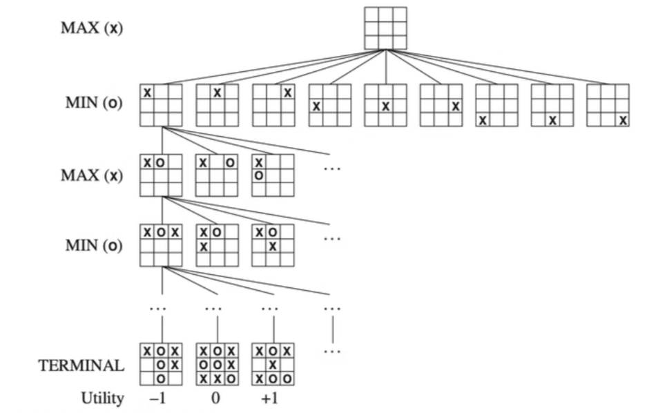

Have you ever played chess games with computer players? Don’t you curious about how computers “think” and make their moves? Let’s dive into the logic behind their decision-making process and explore how they strategize during the game.

### Minimax Algorithm

Commonly in two-player turn-based games like chess, tic-tac-toe, or checkers, the minimax algorithm is the widely used a decision-making algorithm. It models the game as a tree of possible future game states, where each player attempts to maximize their chances of winning (or minimize their chances of losing). The Minimax algorithm assumes that both players play optimally, trying to make the best possible moves for themselves.



In this framework:

- The player making the current move tries to maximize their score (the **Maximizer**).
- The opponent tries to minimize the maximizer's score (the **Minimizer**).

At each game state (node of the tree), the algorithm simulates all possible moves, recursively evaluating future game states until it reaches a terminal state, which is win, loss, or draw. Based on these outcomes, the algorithm calculates a score for each move and selects the one that maximizes the player’s chances of winning.

However, as the game tree grows large in more complex games, evaluating every possible move becomes computationally expensive.

### **Alpha-Beta Pruning**

To improve the strategies with more complicated games, we introduce Alpha-Beta Pruning here. It is an optimization technique for the Minimax algorithm. It effectively reduces the number of nodes the algorithm needs to evaluate, without changing the final result. By "pruning" branches of the game tree that won't affect the final decision, Alpha-Beta pruning allows the algorithm to skip unnecessary calculations, making the search process more efficient.

The pruning process is controlled by two variables:

- **Alpha**: The best score that the maximizer can guarantee so far.
- **Beta**: The best score that the minimizer can guarantee so far.

During the search, if the algorithm finds a branch where the score is worse than a previously evaluated branch, it "prunes" that branch, avoiding further exploration. This ensures that only the most promising game paths are explored.

### Code Overview: Minimax Algorithm with Alpha-Beta Pruning

The following description is based on Fan Zhang's framework for implementing the Minimax algorithm with optional Alpha-Beta pruning in a Tic-Tac-Toe game.

In this Tic-Tac-Toe game:

- The human player can choose between two options: playing first or allowing the AI to go first.
- The player can also decide whether the AI should use the Alpha-Beta pruning optimization.
- If the computer goes first, its initial move will be random. However, after the first move, the algorithm guarantees optimal play, meaning that the human player will find it nearly impossible to beat the AI.

The Minimax algorithm works by evaluating all possible future board states, and when Alpha-Beta pruning is enabled, it optimizes the search to avoid unnecessary computations, speeding up the decision-making process. The `MiniMax` class, which implements the algorithm, begins its search for the optimal move with the following method:

```python
def MinimaxDecision(self, state, usePruning):
    self.usePruning = usePruning
    self.numberOfStates = 0
    best_action, _ = self.MaxValue(state, -math.inf, math.inf)
    print("State space size:", self.numberOfStates)
    return best_action
```

The **`MaxValue`** function evaluates every possible move the AI can make. For each possible action, it generates a new state after making that move and calls `MinValue`, which works similarly from the opponent’s perspective, to evaluate how the opponent would respond. 

```python
def MaxValue(self, state, alpha, beta):
    self.numberOfStates += 1
    if state.isTerminal():
        return None, state.getUtility()

    value = -math.inf
    best_action = None
    for action in state.getActions():
        new_state = state.getResult(action)
        _, min_value = self.MinValue(new_state, alpha, beta)
        if min_value > value:
            value = min_value
            best_action = action
        if self.usePruning:
            if value >= beta:
                return best_action, value
            alpha = max(alpha, value)
    return best_action, value
```

If Alpha-Beta pruning is enabled, it skips unnecessary branches when it’s clear that a move won't yield a better outcome, improving efficiency.

Regardless of the game configuration, the algorithm ensures that the AI will always make the best possible move. This makes the game highly challenging for a human player.

### User Instructions for Running the Game

To start the game, users must configure two settings by answering the following questions:

1. **Do you want to use pruning?**
    - Press `1` for "No" (Standard Minimax algorithm without Alpha-Beta pruning).
    - Press `2` for "Yes" (Minimax algorithm with Alpha-Beta pruning).
    
    This setting determines whether the computer player will use the Alpha-Beta pruning optimization for faster and more efficient decision-making.
    
2. **Who should start?**
    - Press `1` if the user wants to play first.
    - Press `2` if the computer should start.

If the computer starts, its first move will be randomly selected to add a slight variation, but after that, it will play optimally.

When the game starts, the program will display a visual numbering of the squares on the Tic-Tac-Toe board. This helps the user understand how to select their desired square when making a move. This feature simplifies user interaction with the game, making it more intuitive to pick squares.

### Summary

The combination of the Minimax algorithm with Alpha-Beta pruning ensures that the AI in this Tic-Tac-Toe game plays optimally and efficiently. By allowing users to control whether to use pruning and who starts the game, the implementation offers flexibility while demonstrating the power of these classical AI algorithms.