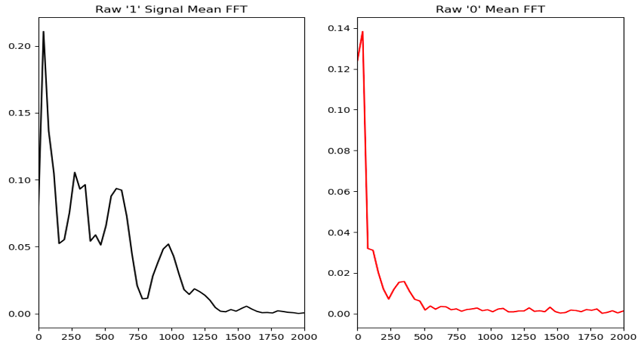
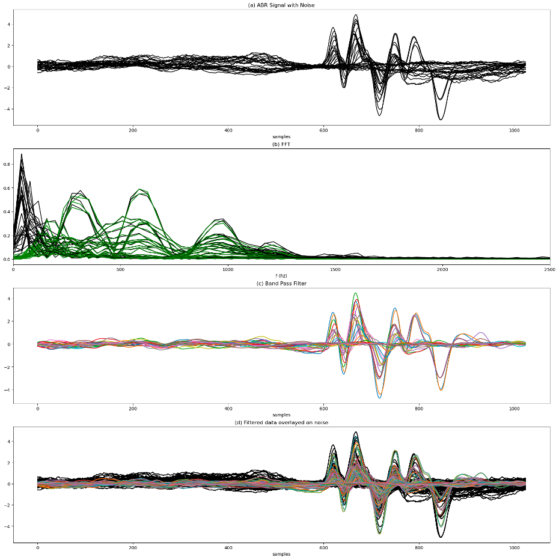
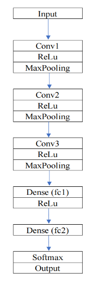
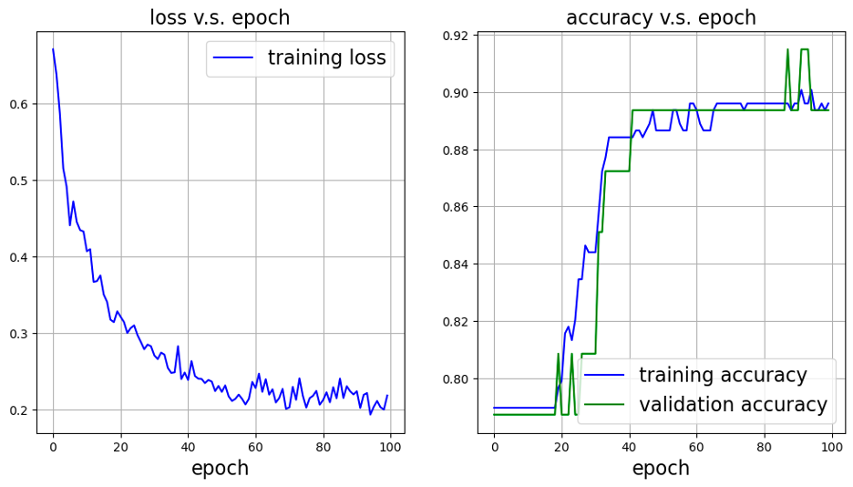

Auditory Brain Response (ABR) data reflects the electrical activity generated by the auditory nerve and brainstem in response to sound stimuli. It is utilized as a diagnostic procedure that allows researchers to estimate hearing sensitivity in subjects that are unable to relay behavioral hearing information. The goal of this project is to create a convolutional neural network (CNN) that finds the threshold, maximum amplitude, and latency of specific waves in our ABR dataset.

### Data Preprocessing

Data from three rats tested at seven frequencies were obtained from Dr. Ragjuru’s lab at the University of Miami Medical Campus. Signals were recorded via a sensing electrode surgically placed behind each rodent's ear and stored as discrete signals using Intelligent Hearing Systems (IHS) software, outputted as text files. Data included recordings from both ears across 14 sound intensities (90 dB to 20 dB in 5 dB increments) to determine hearing thresholds. This resulted in approximately 512 recordings, each containing around 1024 samples. The text files were organized into a data frame in Python using the Pandas package, and thresholds identified were paired with the data. 

We performed multiple Fourier Transforms on the mean data from both ears to identify the appropriate filtering range for input arrays to the CNN. A band-pass filter was applied to the raw data to eliminate high and low-frequency noise, enhancing the signal of interest. 

The chart on the left displays the Fast Fourier Transform (FFT) of the average array from all recordings labeled "1" (indicating signal), while the chart on the right shows the FFT for the mean of the data labeled "0" (indicating no signal).

Based on the figure above: (a) Sample representation of the raw data. (b) FFT of the raw data displayed in black, with the selected bandpass filter range ([100 - 1500] / Nyquist) overlaid in green. (c) Representation of the new filtered data. (d) The filtered data overlaid on the raw data for comparison.

### Building Neural Network

 Based on the filtered data, we built the convolutional neural network for classification and further prediction in Pytorch. The processed dataset was split 80% for training set and 20% for testing set, then divide 10% of testing set as validation set. 

The model combines three convolutional pooling layers and two fully-connected layers. Each convolutional layer utilizes the kernel size of 5, and the output layer contains 2 neurons to equal the number of classes (signal present or signal absent). Then we add fully-connected layers to learn the complex relationships between the extracted features from the earlier layers and the output, which can control the overfitting of training set data. We also use the softmax function in the last layer for our binary classification, so that the model can produce the probability distribution. 

             

After 100 Epoch in Pytorch with a learning rate of 0.001, we got the best model whtn epoch is 89. We also produced confusion matrix from training the model on the testing set, which is [12, 6; 9, 91]. Therefore, the result of sensitivity and precision of two classes. The sensitivity of the first class (no signal) is approximately 0.67, while the second class (clear signals) has 0.91. For precision, the first class has the value of 0.57, and the second class has 0.94. The average accuracy of the model across all classes is 0.87, which indicates that the result of the CNN model could be sufficiently valid as a starting point for expanding analysis. 

### Discussion

The FFT is a valuable method for identifying applicable filters for the data. It helps extract relevant frequency information from the signal of interest compared to recordings where the signal is absent. Future studies can leverage the differences observed in FFT, such as the nuances between recordings from different ears, to develop more accurate models. Additionally, the filtered data and thresholds determined by the CNN could serve as a foundation for distinguishing signal recordings from those without a detectable signal. This approach may automate the extraction of amplitude and latency for key peaks, reducing confusion in peak detection algorithms when analyzing data lacking a clear signal.