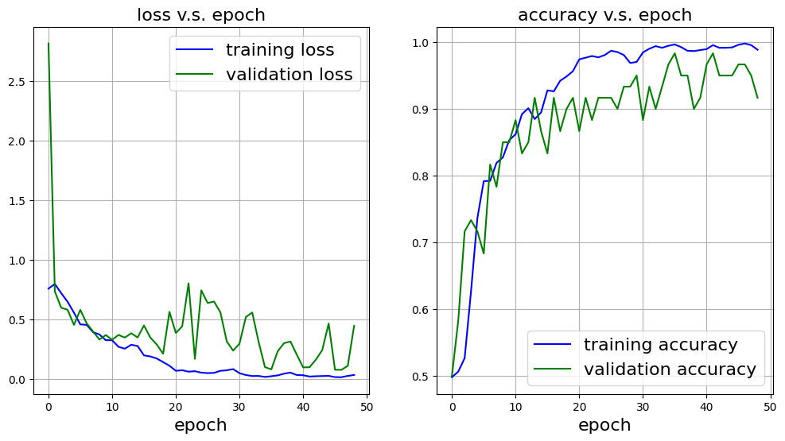
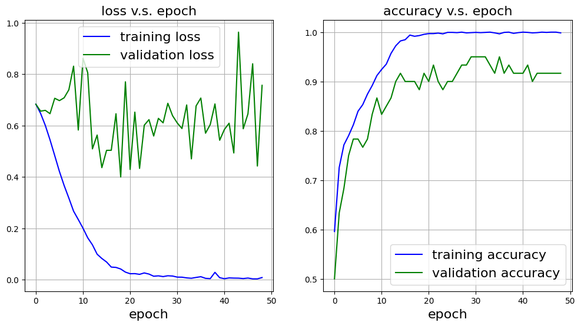
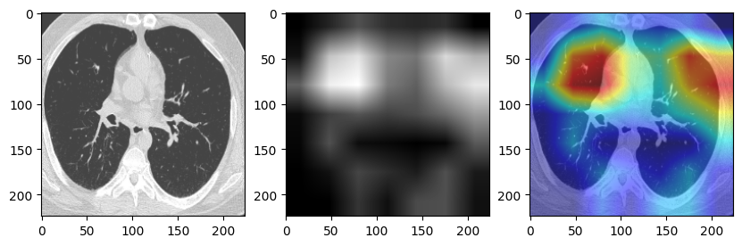
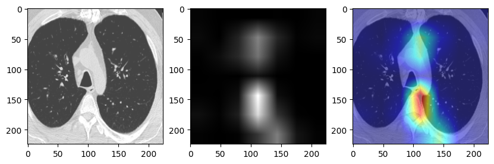
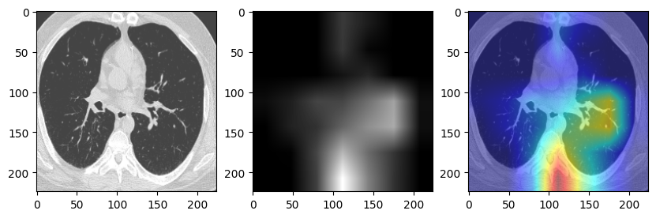
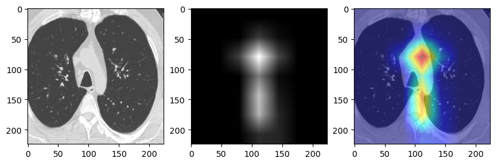

The rapid spread of COVID-19 has necessitated innovative approaches for timely and accurate diagnosis. One promising method involves the use of transfer learning, a machine learning technique that leverages pre-trained models to enhance diagnostic accuracy using limited data. By applying transfer learning to CT images, we can effectively identify and classify COVID-19 cases. 

### Construct a 2D CNN

The sample data are divided into three datasets, training set, validation set, and test set. After import the image data in PyTorch, here we used resnet50 as the base model and modified the last layer for binary classification:

```python
class Net(nn.Module):
    def __init__(self):
        super().__init__()       
        self.resnet50 = tv_models.resnet50()         
        self.resnet50.fc=torch.nn.Linear(2048, 1)           
        
    def get_trainable_parameters(self):
        pList=list(self.resnet50.layer4.parameters())+list(self.resnet50.fc.parameters())
        return pList
    
    def forward(self,x):
        z = self.resnet50(x)
        z = z.view(-1)
        return z
```

The `Net` class in PyTorch defines a custom model that modifies the pre-trained ResNet-50 for binary classification. The `get_trainable_parameters` method retrieves a list of trainable parameters from the last layer and the fourth layer of ResNet. The `forward` method processes the input data through the modified ResNet-50 and reshapes the output into a one-dimensional tensor for compatibility with binary classification tasks.

### Model Test

In the `train` function, set the model to training mode by calling `model.train()` for a single epoch. Similarly, in the `test` function, use `model.eval()` to switch the model to evaluation mode for assessing its performance. Then we can start the training-validation process.

```python
for epoch in range(epoch_save+1, epoch_save+50):
    t0=time.time()
    #-------- training --------------------------------
    loss_train, acc_train =train(model, device, optimizer, loader_train, epoch)    
    loss_train_list.append(loss_train)
    acc_train_list.append(acc_train)
    print('epoch', epoch, 'training loss:', loss_train, 'acc:', acc_train)
    t1=time.time()
    print("time cost", t1-t0)
    #-------- validation --------------------------------
    loss_val, acc_val, other_val = test(model, device, loader_val)
    loss_val_list.append(loss_val)
    acc_val_list.append(acc_val)
    print('epoch', epoch, 'validation loss:', loss_val, 'acc:', acc_val)   
    #--------save model-------------------------
    result = (loss_train_list, acc_train_list, 
              loss_val_list, acc_val_list, other_val)
    save_checkpoint('CNN_LS_Pytorch_epoch'+str(epoch)+'.pt', model, optimizer, result, epoch)
    epoch_save=epoch
    #------- show result ----------------------
    display.clear_output(wait=False)
    plt.close('all')
    fig, ax = plot_result(loss_train_list, acc_train_list, 
                          loss_val_list, acc_val_list)
    display.display(fig)
```

This code clip is part of a training loop for a deep learning model, running for 50 epochs starting from a saved epoch. In each epoch, it measures the time taken for training and validation processes. The model is trained using the `train` function, which returns the training loss and accuracy, both of which are recorded in respective lists. After training, the model's performance is validated using the `test` function, and the validation loss and accuracy are similarly stored. 



The results from training and validation are saved to a checkpoint file for future reference. Finally, the training progress is visualized by plotting the loss and accuracy metrics, updating the display for continuous monitoring of the model's performance over epochs.

### Transfer Learning

Based on the previous model, now we loads a pre-trained ResNet-50 model with weights from ImageNet (`ResNet50_Weights.DEFAULT`), which is typical in transfer learning. Additionally, all layers except for `layer4` and the final fully connected layer are frozen. This means the model leverages pre-trained feature extraction layers and only fine-tunes the last few layers to adapt to the new task. Like the first code, the final fully connected layer is replaced for binary classification, but only this layer and `layer4` are trainable.



By loading the best model from all the epoch results, we can efficiently calculate the classification accuracy. Using transfer learning, we achieved an accuracy of 95.25%, which is an improvement over the previous accuracy of 93.5%.

### Result Visualization

To better understand how the model makes decisions, we visualized the kernels of the first convolutional layer using Class Activation Mapping (CAM) methods. Specifically, we implemented GradCAM and EigenCAM techniques. GradCAM utilizes the gradients flowing into the last convolutional layer to generate a localization map, highlighting regions of the input image that contributed most to the final classification. 





The image on top shows results without transfer learning, while the image on the bottom demonstrates the outcomes using transfer learning.

EigenCAM, on the other hand, is a faster method that uses the principal components of the feature maps to create a heatmap. By employing both methods, we can effectively interpret the learned features and understand which parts of the input images are influencing the model's decisions, providing valuable insights into its behavior and the relevance of different features during classification. This visualization helps in debugging the model and can also improve its transparency and trustworthiness.





The image on top shows results without transfer learning, while the image on the bottom demonstrates the outcomes using transfer learning.